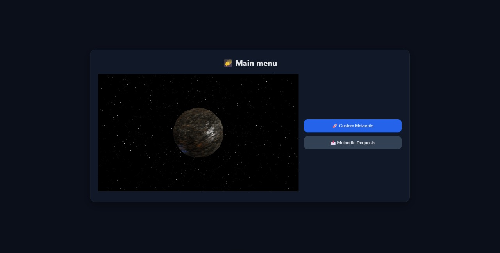
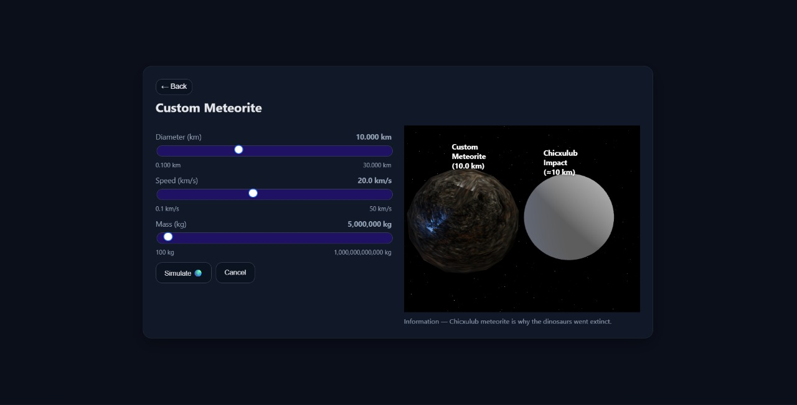
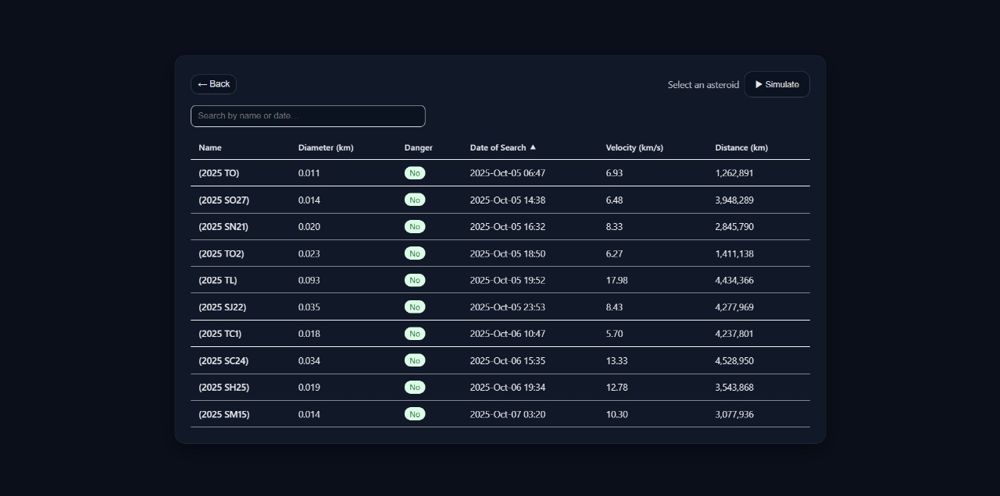
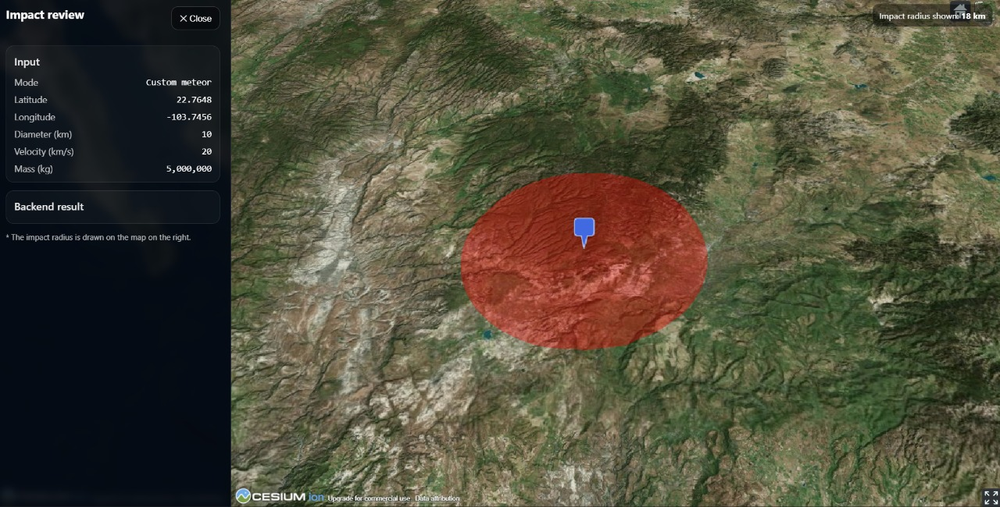

# ☄️ MeteorMadness

### 🌌 Project submitted to **NASA Space Apps Challenge 2025**

---

## 🧠 Abstract

**MeteorMadness** is an interactive, educational web app built for the **NASA Space Apps 2025** hackathon.  
It visualizes the **environmental damage and potential impact** a meteor strike could cause on Earth using real data from the **NASA NEO (Near-Earth Objects) API**.

With this app you can:
- Browse **real near‑Earth asteroids** recorded by NASA over recent days.
- Create a **custom meteor** (choose size and velocity).
- Simulate an impact on a geographic location and **compare it to the Chicxulub meteorite** that contributed to dinosaur extinction.

Results are rendered on a 3D globe with **CesiumJS**, highlighting impact point, damage area and estimated released energy.

---

## 🏗️ Project Structure

```
MeteorMadness/
│
├── backend/                       # FastAPI server (REST API)
│   ├── app/
│   │   ├── api/                   # HTTP routes / endpoints
│   │   │   ├── routes_nasa.py     # NASA NEO endpoints
│   │   │   ├── physicsapi.py      # Physics / simulation endpoints
│   │   ├── clients/               # External API clients
│   │   │   ├── nasa_client.py     # NASA NEO client
│   │   │   ├── usgs_client.py     # USGS client
│   │   │   ├── isit_client.py     # IsItWater client
│   │   ├── core/                  # Settings / helpers
│   │   ├── domain/                # Business logic + models
│   │   │   ├── physics/           # Impact math / formulas
│   │   │   │   ├── impact.py
│   │   │   ├── schemas.py         # Pydantic schemas (IO contracts)
│   │   ├── services/              # Orchestration & use cases
│   │   │   ├── nasa_service.py
│   │   │   ├── physicService.py
│   │   │   ├── config_manager.py
│   │   ├── main.py                # FastAPI app entrypoint
│   │   ├── .env                   # Secrets (not committed)
│   │   ├── .env.example           # Example environment
│   ├── requirements.txt           # Backend dependencies
│
├── frontend/                      # React + Vite + TypeScript UI
│   ├── public/
│   │   ├── cesium/                # Cesium assets / widgets
│   │   ├── textures/              # Globe textures
│   ├── src/
│   │   ├── api/                   # Backend API client
│   │   │   ├── client.ts
│   │   ├── components/            # UI components
│   │   │   ├── CesiumGlobe.tsx
│   │   │   ├── AsteroidTable.tsx
│   │   │   ├── CustomMeteorPanel.tsx
│   │   │   ├── MeteorComparation.tsx
│   │   │   ├── LoadingOverlay.tsx
│   │   │   ├── MainMenu.tsx
│   │   │   ├── StartScreen.tsx
│   │   ├── styles.css
│   │   ├── main.tsx               # React bootstrap
│   │   ├── App.tsx                # App layout
│   ├── package.json
│   ├── tsconfig.json
│   ├── vite.config.ts
│   ├── .env.example               # Example frontend env (Cesium token, API base)
│
└── README.md
```

---

## ⚙️ Technologies

### 🧩 Backend
- **FastAPI** — Web framework (REST)
- **NumPy** — Scientific computing for impact math
- **Pydantic** — Data validation & type-safe schemas
- **Uvicorn** — ASGI server

### 🎨 Frontend
- **React**
- **TypeScript**
- **Three.js** — Complementary 3D utilities
- **Vite**
- **CesiumJS** — 3D globe & terrain

### 🛰️ External APIs
- **NASA NEO** → https://api.nasa.gov/
- **USGS ScienceBase** → https://github.com/DOI-USGS/sciencebasepy
- **IsItWater** → ocean/land detection by coordinates
- **Cesium Ion** → global 3D terrain/imagery

---

## 🧭 High‑Level Flow

1. **Frontend** requests near‑term NEOs → `GET /api/nasa/meteors`
2. **Backend** fetches & filters NASA NEO data → returns clean fields (name, speed, diameter, distance)
3. The user selects a **real** meteor or defines a **custom** one
4. **Backend** computes impact physics (energy, crater, damage radii) via `domain/physics/impact.py`
5. **Frontend** renders the result on **Cesium** (GeoJSON overlays with red shaded areas)

---

## 📸 Screenshots

| Home (menu) | Custom meteor selection | NASA list | Simulator |
|---|---|---|---|
|  |  |  |  |

> Place your images under `docs/img/` with these file names: `menu.jpeg`, `custom.jpeg`, `list.jpeg`, `simulation.jpeg`.

---

## 🔑 Environment

### Backend `.env` (copy from `.env.example`)

```env
NASA_API_KEY=YOUR_NASA_API_KEY
USGS_USER=your_usgs_username
USGS_PASS=your_usgs_password
ISITWATER_API_KEY=your_isitwater_api_key
```

### Frontend `.env` (copy from `.env.example`)

```env
VITE_API_BASE=http://localhost:8000/api
VITE_CESIUM_ION_TOKEN=YOUR_CESIUM_ION_TOKEN
```

---

## 🚀 Run Locally

### Linux / macOS

```bash
# Backend
cd backend
python3 -m venv .venv
source .venv/bin/activate
pip install -r requirements.txt
uvicorn app.main:app --reload

# Frontend (in another terminal)
cd frontend
npm install
npm run dev
```

### Windows

```bash
# Backend
cd backend
python -m venv .venv
.venv\Scripts\activate
pip install -r requirements.txt
uvicorn app.main:app --reload

# Frontend (in another terminal)
cd frontend
npm install
npm run dev
```

---

## 👨‍🚀 Team

- **Acox24** — Backend  
- **Daiavlo** — Backend  
- **Ferzea** — Backend  
- **HersonReyez** — Frontend  
- **AntonioN64** — Frontend  

---

## 🪐 License

Built for the **NASA Space Apps Challenge 2025** for **educational and demonstrative** purposes.
